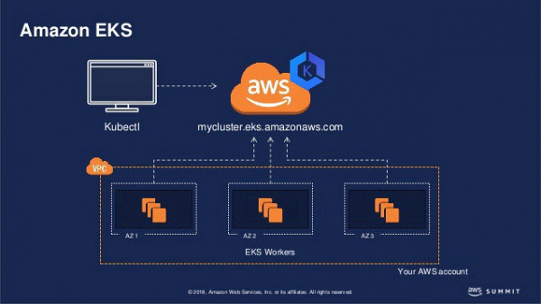
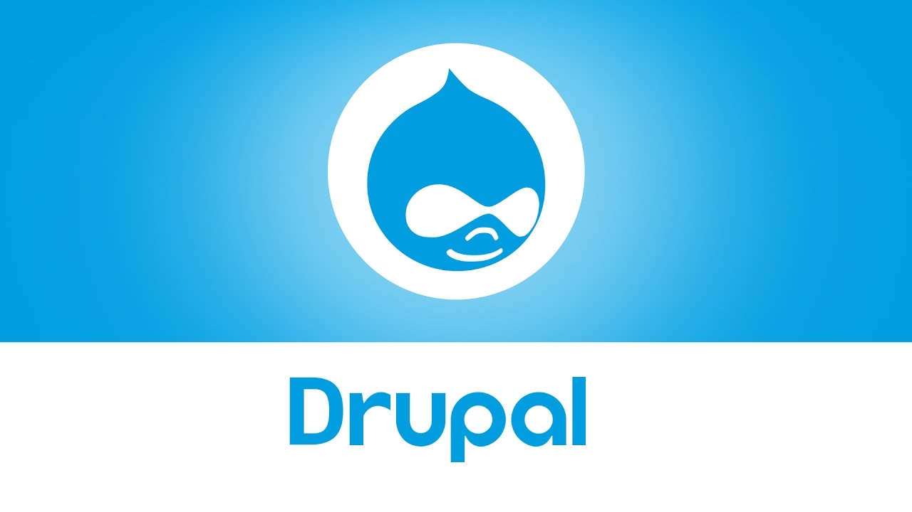
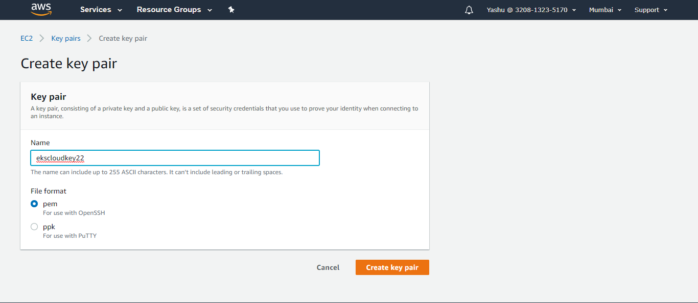
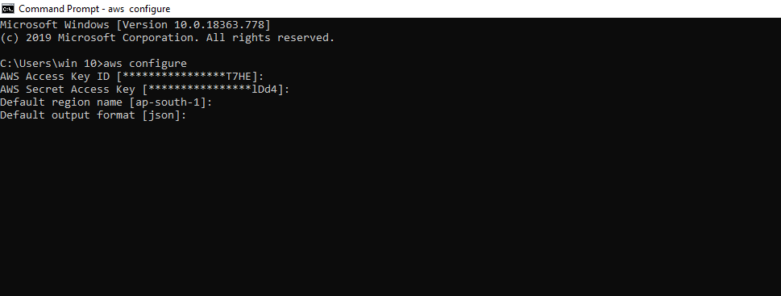
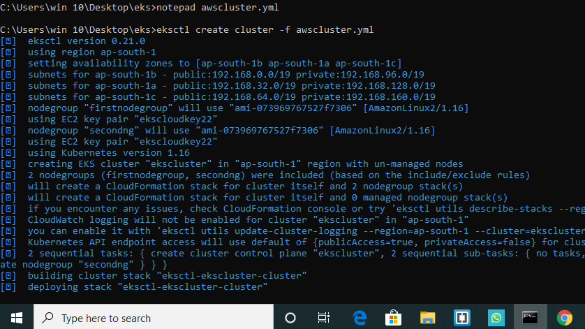
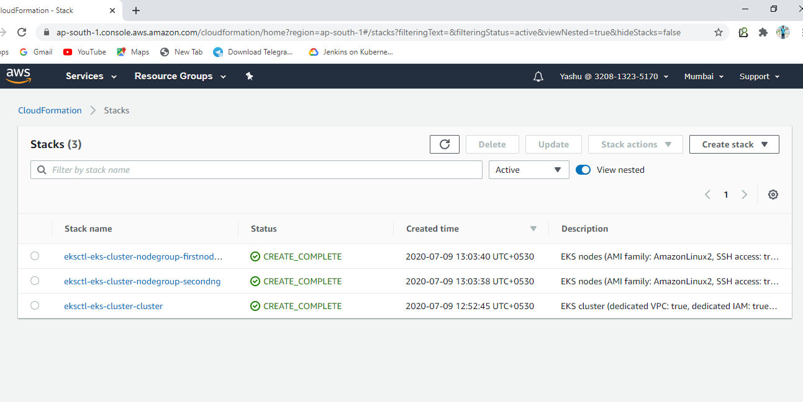
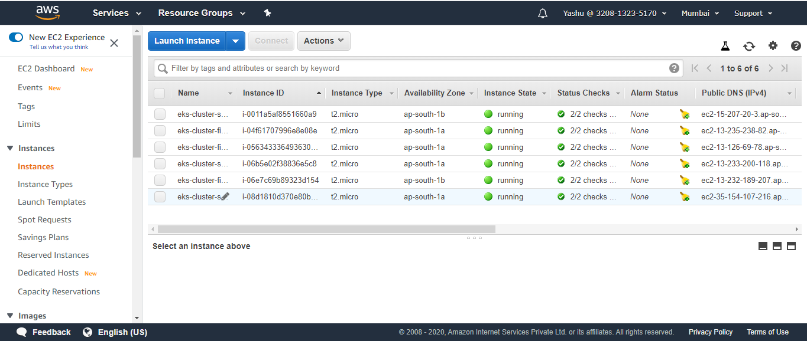
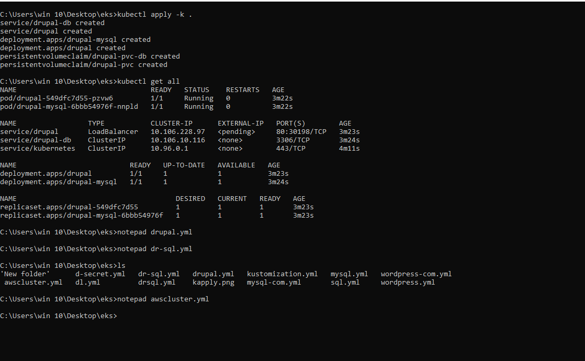
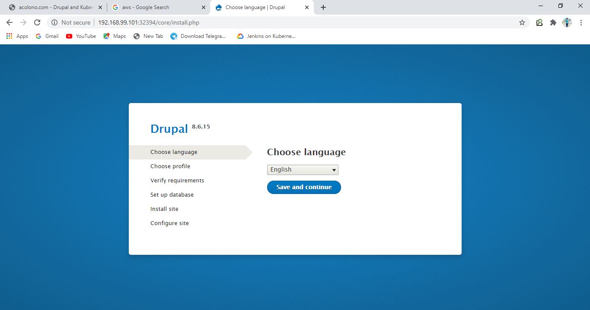

# EKS_amazon: 

# Kubernetes
 Kubernetes is an open-source container-orchestration
 system for automating computer application deployment, 
 scaling, and management. It was originally designed
 by Google and is now maintained by the Cloud Native
 Computing Foundation.
 
 
 

# Elastic Kuberntets Service
   Amazon Elastic Kubernetes Service (Amazon EKS) is
   a managed service that makes it easy for you to 
   run Kubernetes on AWS without needing to stand 
   up or maintain your own Kubernetes control plane.
   Kubernetes is an open-source system for automating
   the deployment, scaling, and management of containerized 
   applications.
   Amazon EKS runs Kubernetes control plane instances across
   multiple Availability Zones to ensure high availability.
   Amazon EKS automatically detects and replaces unhealthy 
   control plane instances, and it provides automated version 
   upgrades and patching for them.
 
 
 
   
   # Drupal
    
   Drupal is a free and open-source web content management
   framework written in PHP and distributed under the GNU
   General Public License. Drupal provides a back-end
   framework for at least 2.3% of all websites worldwide 
   – ranging from personal blogs to corporate, political,
   and government sites.
   
   
   
   Starting with the task
   
 
   
   #  Key Pairs
   
   Creating key pairs for using in our instances.
   
   
   
   # AWS Configure
   
   Configuring aws profile in from our command line.
   
   
   
   
   # EKS Cluster
   For this we have to configure eksctl, official command of AWS EKS.
   
  Launching our eks cluster on amazon cloud.
  
      apiVersion: eksctl.io/v1alpha5
      kind: ClusterConfig

      metadata:
        name: eks-cluster
        region: ap-south-1

      nodeGroups:
      - name: firstnodegroup
        desiredCapacity: 3
        instanceType: t2.micro
        ssh:
          publicKeyName: ekscloudkey22

     - name: secondng
       desiredCapacity: 3
       instanceType: t2.micro
       ssh:
         publicKeyName: ekscloudkey22
  
  Creating cluster with command 
  
          eksctl create cluster -f awscluster.yml
          
  
  
          
  Instances Created
  
   
   YAML file of our cluster
   
   # DRUPAL with MY-SQL
   
   Here we are launching drupal with mysql database.
   we have to create a YAML file for our mysql database.
      
      
        ---   
        apiVersion: v1
        kind: Service
        metadata:
          name: drupal-db
          labels:
            app: drupal
        spec:
          ports:
            - port: 3306
          selector:
            app: drupal
            tier: backend
        ---
        apiVersion: v1
        kind: PersistentVolumeClaim
        metadata:
          name: drupal-pvc-db
        spec:
          accessModes:
          - ReadWriteOnce
          resources:
            requests:
              storage: 2Gi  
        ---
        apiVersion: apps/v1 
        kind: Deployment
        metadata:
          name: drupal-mysql
          labels:
            app: drupal        
        spec:
          replicas: 1
          selector:
            matchLabels:
              app: drupal
              tier: backend
          strategy:
            type: Recreate
          template:
            metadata:
              labels:
                app: drupal
                tier: backend
            spec:
              containers:
              - image: mysql:5.7
                imagePullPolicy: IfNotPresent
                name: mysql
                env:
                - name: MYSQL_DATABASE
                  value: drup-al
                - name: MYSQL_USER
                  value: yash
                - name: MYSQL_PASSWORD
                  value: yash1234
                - name: MYSQL_ROOT_PASSWORD
                  value: rootpassword
              
                ports:
                - containerPort: 3306
                  name: mysql
                volumeMounts:
                - name: mysql-stateful-storage
                  mountPath: /var/lib/mysql
              volumes:
                - name: mysql-stateful-storage
                  persistentVolumeClaim:
                    claimName: drupal-pvc-db
   
   Drupal Code
   
        ---
     apiVersion: v1
     kind: Service
     metadata:
       name: drupal 
       labels:
         app: drupal
     spec:
       ports:  
         - port: 80
           name: web   
           protocol: TCP
           targetPort: 80
       selector:
         app: drupal
         tier: frontend
       type: LoadBalancer
     ---
     apiVersion: v1   
     kind: PersistentVolumeClaim
     metadata:
       name: drupal-pvc
       labels:
         app: drupal
     spec:
       accessModes:
       - ReadWriteOnce
       resources:
         requests:
           storage: 2Gi
     ---
     apiVersion: apps/v1
     kind: Deployment
     metadata:
       name: drupal
       labels:
         app: drupal
         tier: frontend
     spec:
       selector:
         matchLabels:
           app: drupal
           tier: frontend
       strategy:
         type: Recreate
       template:
         metadata:
           labels:
             app: drupal
             tier: frontend
         spec:
           initContainers:
             - name: init-sites-volume
               image: drupal:8.6.15-apache
               command: ['/bin/bash', '-c']
               args: ['cp -r /var/www/html/sites /data; chown www-data:www-data /data/ -R']
               volumeMounts:
               - mountPath: /data
                 name: drupal-pvc
           containers:
           - image: drupal:8.6.15-apache
             imagePullPolicy: IfNotPresent
             name: drupal
             env:
             - name: DRUPAL_DATABASE_HOST
               value: drup-al
             - name: DRUPAL_DATABASE_PASSWORD
               value: yash1234
            
             ports:
             - containerPort: 80
               name: drupal
             volumeMounts:
             - name: drupal-pvc
               mountPath: /var/www/html/modules
               subPath: modules
             - name: drupal-pvc
               mountPath: /var/www/html/profiles
               subPath: profiles
             - name: drupal-pvc
               mountPath: /var/www/html/sites
               subPath: sites
             - name: drupal-pvc
               mountPath: /var/www/html/themes
               subPath: themes
       
           volumes:
             - name: drupal-pvc
               persistentVolumeClaim:
                 claimName: drupal-pvc
   
 Kustomization file 
                     
                     apiVersion: kustomize.config.k8s.io/v1beta1
                     kind: Kustomization
                     resources:
                       - drupal.yml
                       - dr-sql.yml
                
 Launching the Kustomization with command
       
            kubectl apply -k .

Drupal web is ready

